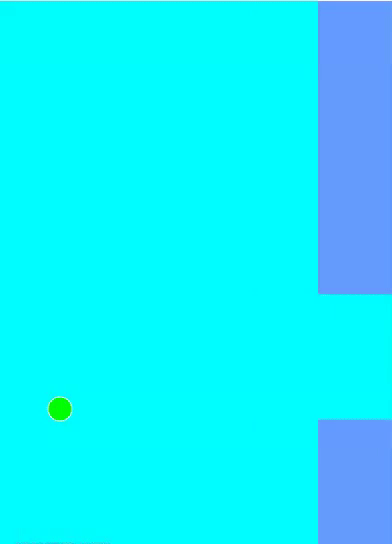

# INT-404-PROJECT
Project submission for CA3 a flappy bird game which runs on the basis of NEAT neuro evolution of augmented topologies which is basically mixture of genetic algorithm and neural networks.

<h1 align="center">Flappy Bird Ai</h1>

  

