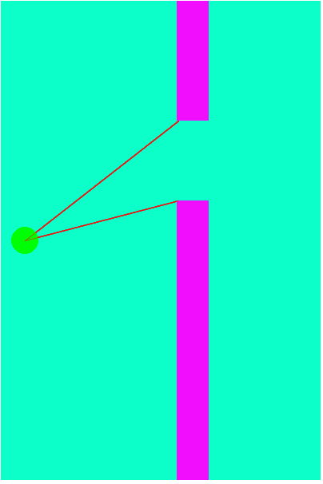
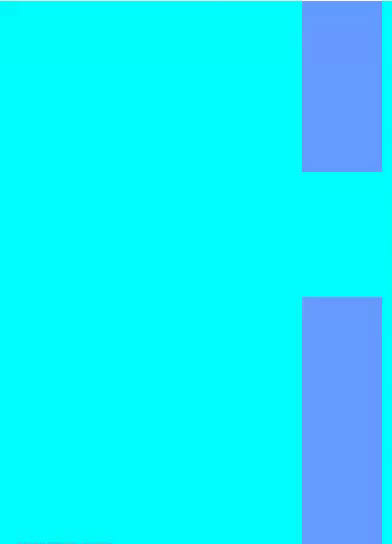
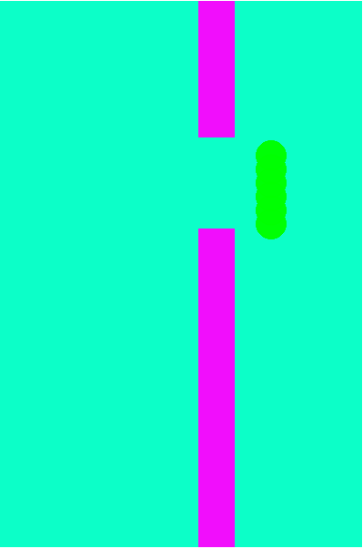

# INT-404-PROJECT
Project submission for CA3 a flappy bird game which runs on the basis of NEAT neuro evolution of augmented topologies which is basically mixture of genetic algorithm and neural networks.

To test for youself click, <a href="https://a8hay.github.io/INT-404-PROJECT">here</a>

<h1 align="center">Flappy Bird Ai</h1>

  

<h4 align="center">AI plays Flappy Bird using Neuroevolution of augmenting topologies (NEAT)</h4>
Every generation starts with the population of 200 birds. Every bird has it's own corressponding neural network. The aim is to go through the gap present between the pipes without colliding with ant of them. Once all the birds are dead, next generation is generated. For every 200 individuals of next generation 2 parents are selected from the previous genertion. The selected two parents are crossovered, followed by some percentage of mutation(generally low %).

<h4 align="center">Every bird knows about it's distance from top and bottom pipes</h4>

  

<h4 align="center">This is what initial Generations do (utter chaos!)</h4>

  

  Initially birds have no idea what to do they randomly tries to move up or down and eventually most of them dies by colliding        with the pipes few passes through the pipes and these are than used to generate a brand new generation which are better than the previous ones as their neural network is closer to the one which passed the pipes.

  

As the generations passes by we see improvements and eventually after around 20 generation we see a master AI which seems it would go on forever (not really but you know)

  

